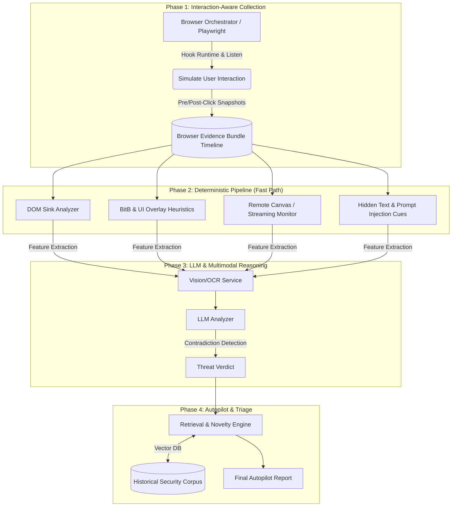

# Browser Security Architecture: Next-Generation Threat Detection Engine

> **CONFIDENTIAL & PROPRIETARY**  
> Copyright © 2026 Akash Singh. All Rights Reserved.  
> **PATENT PENDING**  
> 
> *This documentation, including all architecture designs, methodologies, and source code outlined herein, constitutes proprietary intellectual property. No part of this repository may be reproduced, distributed, or transmitted in any form or by any means, including photocopying, recording, or other electronic or mechanical methods, without the prior written permission of the copyright holder, except in the case of brief quotations embodied in critical reviews and certain other noncommercial uses permitted by copyright law.*

---

## 🚀 Overview

The **Browser Security Architecture Engine** is a hybrid, next-generation threat detection system designed to identify and neutralize sophisticated, rendering-layer web threats at **initial access time**. 

Unlike traditional Endpoint Detection and Response (EDR) agents or static URL-reputation engines, this architecture operates directly inside the browser's Document Object Model (DOM), JavaScript runtime, and visual rendering pipeline. It is purpose-built to catch advanced evasion techniques that easily bypass legacy systems, including:

- **Browser-in-the-Browser (BitB) & Fake Popups**
- **Adversary-in-the-Middle (AiTM) / Evil Proxy Phishing**
- **Remote-Browser / Canvas Streaming Abuse (e.g., noVNC, Kasm)**
- **In-Memory / DOM-Injected Phishing (Post-Interaction Execution)**
- **Prompt Injection & Agentic-AI Abuse**
- **Malicious Redirects & DOM Abuse**

By combining **interaction-aware data collection** (Playwright-driven orchestration), a **deterministic heuristics pipeline**, and an **LLM-assisted multimodal reasoning layer**, this system enables high-volume triage with automated retrieval-augmented novelty detection.

---

## 🧬 Core Architecture

The pipeline processes URLs through four distinct, state-driven phases:



---

## 🛡️ Key Features & Threat Models Mitigated

### 1. Browser-in-the-Browser (BitB) Defeat
Traditional visual scanners fail when attackers render a perfectly legitimate-looking "native" address bar inside the browser window. Our engine detects these CSS/HTML anomalies (e.g., high `z-index` overlays mapping to OS window controls) algorithmically.

### 2. Remote-Browser Streaming (noVNC) Detection
Attackers increasingly use attacker-controlled containers to stream pixels to the victim, completely removing the DOM payload. We detect these via canvas fingerprinting—identifying `100% viewport` `<canvas>` elements that lack an underlying DOM tree.

### 3. Interaction-Aware Transition Graphs
Many modern threats (Delayed DOM XSS) hide payloads until the user interacts with the page (e.g., clicking a button). Our **Browser Orchestrator** automatically identifies candidate SSO/Login buttons, simulates human interaction, and maps state transitions between "Pre-Click" and "Post-Click" to catch dynamic `setTimeout`, `innerHTML`, and `new Function` sinks.

### 4. Multimodal Contradiction Detection
Our LLM Analyzer explicitly compares the visual rendering of the page against network telemetry. 
*Example Check:* "Does the visual logo (OCR text) claim 'Microsoft' while the final URL resolves to an unrecognized, non-Microsoft domain?"

### 5. Agentic-AI Abuse Prevention (Prompt Injection)
We extract hidden text, zero-opacity font manipulation, `<!-- HTML comments -->`, and Markdown embedded in `alt` tags designed specifically to hijack downstream RAG engines or LLM web-scrapers.

---

## 📂 Repository Structure

| Path | Purpose |
|------|---------|
| `src/orchestrator/sandbox.py` | Headless Playwright orchestration, DOM hooking, and multi-state timeline capture. |
| `src/scripts/hook_sandbox.js` | Critical JS injected at page load to intercept `document.write`, `eval`, `setAttribute`, mutations, and BitB anomalies. |
| `src/models/evidence.py` | Pydantic schema for the canonical `BrowserEvidenceBundle` and `SessionEvidenceTimeline`. |
| `src/detectors/pipeline.py` | The deterministic rule engine checking for OWASP sinks, redirect chains (AiTM), and canvas anomalies. |
| `src/reasoning/analyzer.py` | The LLM-assisted layer leveraging OpenAI GPT-4o for complex contradiction logic. |
| `src/retrieval/novelty.py` | A TF-IDF/Cosine VectorDB simulator for clustering new attacks against historical corpuses. |
| `data/corpus/security_corpus.json` | Ground truth dataset of Promptfoo injection payloads and OWASP sink signatures. |
| `tests/` | Comprehensive Pytest suite with highly specialized local HTML mock attacks. |

---

## 🛠️ Setup & Installation

**Prerequisites:** Python 3.9+, Node.js (for Playwright dependencies).

1. **Clone the repository:**
   ```bash
   git clone https://github.com/akashsingh/browser-security.git
   cd browser-security
   ```

2. **Setup Virtual Environment:**
   ```bash
   python3 -m venv .venv
   source .venv/bin/activate
   ```

3. **Install Dependencies:**
   ```bash
   pip install -r requirements.txt
   playwright install chromium
   ```

4. **Environment Variables:**
   For Phase 3 (LLM Reasoning), provide your OpenAI API key.
   ```bash
   export OPENAI_API_KEY="sk-..."
   ```

---

## 🚦 Usage & Evaluation

### Run the End-to-End Pipeline

Execute the primary entry point against any URL to generate an automated triage report:

```bash
python main.py "https://example.com"
```
*(Append `--headed` to run Playwright with a visible UI for debugging).*

Upon execution, the engine will automatically drop a comprehensive JSON report into the `/reports/` directory containing the `Verdict`, `Confidence`, `Key_Indicators`, and `Extracted_IOCs`.

### Running the Test Suite

We maintain a rigorous test suite simulating complex enterprise attack vectors. 

```bash
pytest -v tests/test_pipeline.py
```

**Covered Test Scenarios:**
- ✅ Benign Enterprise SSO Pages (Zero False Positives)
- ✅ Complex BitB + Eval Executions
- ✅ Delayed DOM XSS / Post-Interaction Payloads
- ✅ Promptfoo Hidden Injection Vectors (Comments / Alt text)
- ✅ Remote Browser Canvas Streaming (noVNC)
- ✅ AiTM Multi-Hop Redirect Chains
- ✅ OWASP Sink Hooking (`document.write`, `setAttribute`, `new Function`)

---

## 📜 Intellectual Property & Licensing

**IMPORTANT:** This repository, including all underlying logic, interaction methodologies, JavaScript runtime hooking strategies, and multimodal evaluation prompts, is the intellectual property of Akash Singh. 

* Patent Pending regarding the combination of multi-state interaction-aware extraction with multimodal contradiction modeling for browser threat detection.
* No license is granted for commercial deployment, reverse-engineering, or integration into third-party security platforms without an explicit commercial licensing agreement.

Contact [Akash Singh] for licensing inquiries or collaborative research permissions.